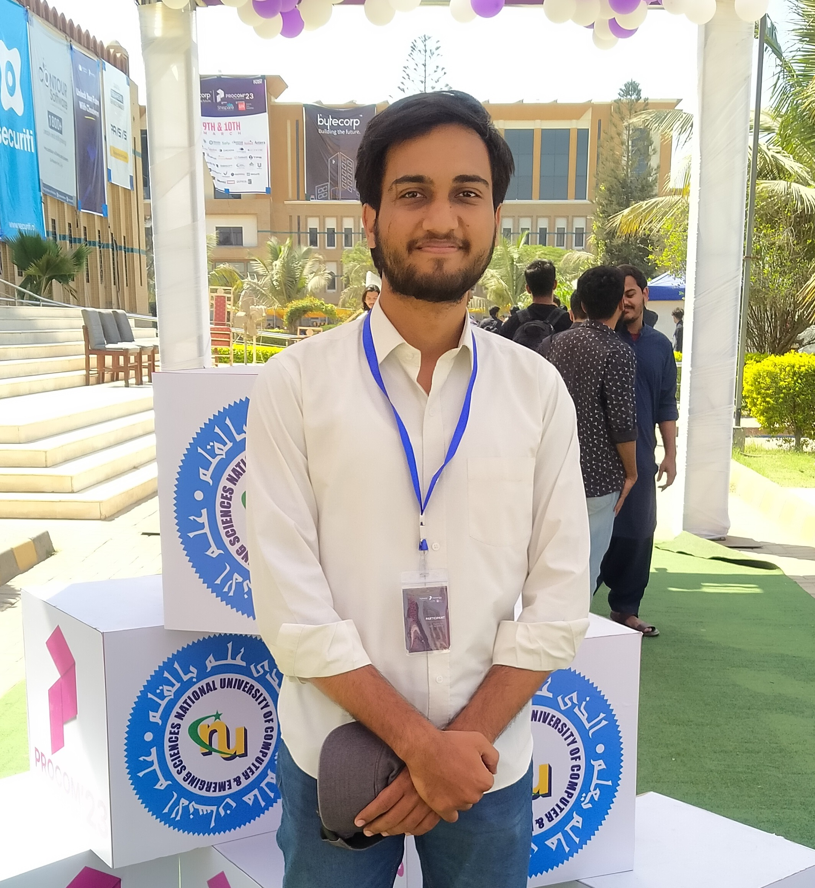

<h1 align="center">Welcome To My Github Profile</h1>

# Muhammad Umar Anzar
**Software Developer** | **Junior Data Scientist** | **Bachelor in Computer Science**

## About me
I am a bachelor's final-year computer science student with a strong background in logic building and programming languages. I have
worked on data science projects and am familiar with the fundamental front-end and back-end development technologies. I am
a collaborative team player with good communication skills and a strong work ethic, and am determined to make a difference in
the field.

## Experience

### Machine Learning Engineer, [SeedInov](https://seedinov.com)
>October 2023 – Present (Part-time & Remote)
- Researching and implementing machine learning and AI solutions to improve the company's products and services.

### Data Science Trainer, [Applied DataLab](http://applieddatalab.com)
>August 2023 – Present (Freelance & On-site)
- Providing programming assistance to the class and facilitating the preparation of assignments.

### Data Science Intern, [the Sparks Foundation](https://www.thesparksfoundationsingapore.org)
> April 2023 – May 2023
- Created ML models to analyze provided datasets, forecast hidden data, and
evaluate model precision.
- Performed exploratory data analysis (EDA) procedures to learn new facts about
the datasets.

### AI Research Intern, [National Center for Cyber Security (NCCS)](https://www.nccs.pk)
> March 2022 – April 2022
- Researched state-of-the-art algorithms for insider threat detection and gained
exposure to various machine learning techniques such as recommendation
systems and BERT.
- My brief internship experience sparked my interest in the field of machine
learning and provided valuable learning opportunities

## Skill Highlights

| Skills           |               |            |            |
|------------------|---------------|------------|------------|
| Machine Learning |---------------|------------|------------|
|                  | Numpy         | SnapMl     | Matplotlib |
|                  | Scikit-learn  | Pandas     | Seaborn    |
|                  | Scipy         |            |            |
| Web Development  |---------------|------------|------------|
|                  | JavaScript    | NodeJs     | Html       |
|                  | ThreeJs       | ExpressJs  | Css        |
| Database         |---------------|------------|------------|
|                  | MongoDb       | PostgreSQL | SQL Server |

## Projects

  

    <a href="https://github.com/umar-anzar/datacamp-spotify-competition"  target="_blank"> 
      <b>🏆 Datacamp 2023 Competition Winner Notebook</b>
    </a>
  

  
1st Position Winners of the DataCamp "Create the Perfect Party Playlist" Competition 2023 (Umar & Faizan).

  
<b>Ongoing Final Year Project: Haazir - On-Demand Service Providing App</b>

  
A service-providing mobile app basically takes the idea of ride-hailing services like Careem and Uber and transforms it into a service-providing system so that people can hire these services from the comfort of their homes instead of searching various places to find these workers.

  
<b>Kaggle Challenge – Titanic: ML from Disaster</b>

  
Using manual & auto hyperparameter search and voting classifier for improved accuracy.

  
<b>Computer Vision and Object Detection API</b>

  
A PYQT-based GUI hand gesture recognition application that interprets human hand gestures to form. Although I did not have the opportunity to work on it professionally, I gained experience in using computer vision and object detection APIs.

  

    <a href="https://github.com/umar-anzar/ubitJavaProject"  target="_blank">
      <b>Object-Oriented Programming Application (Hazir)</b>
  </a>
  

  
A service-providing application prototype built in Java Swing GUI using SQLite as the database.

  

    <a href="https://github.com/umar-anzar/karachi-city-computer-graphics"  target="_blank">
      <b>3D Procedural City Generation of Karachi using THREE.js </b>
    </a>
  

  
Procedural City Generation in THREE.js: Random Buildings, Custom Camera, Quaid-e-Azam and Rickshaw Models, and Three Perspectives.

  

    <a href="https://github.com/umar-anzar/finite-ball-the-game"  target="_blank">
      <b>Finite State Machines Turn Based Game (Finite Ball)</b>
    </a>
  

  
A two-player 2D soccer game (Pygame) similar to air hockey, with transition-based movement and actual In-elastic collision physics.

  

    <a href="https://github.com/umar-anzar/Front-End-Compiler-Project"  target="_blank">
      <b>Mio Programming Language - Front-End-Compiler-Project</b>
    </a>
  

  
MIO programming language features a front-end compiler that performs lexical, syntactic, and semantic analysis.

  
<b>Python Discord API (Galileo-Private)</b>

  
A Heroku-hosted Discord bot with some of my own custom basic commands.

  
<b>Python GUI application using PYQT5</b>

  
Simple FTP file backup application that connects to the server and downloads all files recursively for backup.

## Certifications

- IBM (Coursera)
  - Machine Learning with Python
  - Python for Data Science
- DataCamp
  - Introduction to Statistics
- University of Michigan (Coursera)
  - HTML | CSS | JS | Responsive Design

## Competitions
- Kaggle Challenge – Titanic: ML
  - Achieved 78.7% accuracy

- Procom’23 – Data Scientist
  - Achieved second-best accuracy and Third position overall. 

### Education
- Bachelors in Computer Science                                    
University of Karachi | UBIT | CGPA: 3.57 |
2019- Present

- Intermediate (Pre-engineering)         
DA SKBZ College | Karachi
2017-2019

- Cambridge O level                                   
The Oasys School | Karachi
2015-2017 

### Contact Info
- **Phone**: +92 317 2456854
- **Email**: omer.anzar2@gmail.com

<h2 align="center">How To Reach Me</h2>

  <a href="mailto:omer.anzar2@gmail.com" target="_blank" title="gmail">
    <image align="center" src="images_icons/gmail.png" width="7%" alt="Umar's Email">
  </a>
  <a href="https://www.facebook.com/omer.anzar.7/" target="_blank" title="facebook">
    <image align="center" src="images_icons/facebook-social-logo.png" width="7%" alt="Umar's facebook account">
  </a>
  <a href="https://twitter.com/paradox_omer" target="_blank" title="twitter">
    <image align="center" src="images_icons/twitter.png" width="7%" alt="Umar's twitter account">
  </a>
   <a  target="_blank" href="https://www.linkedin.com/in/umar-anzar" title="linkedin">
    <image align="center" src="images_icons/linkedin.png" width="7%" alt="Umar's twitter account">
  </a>  

